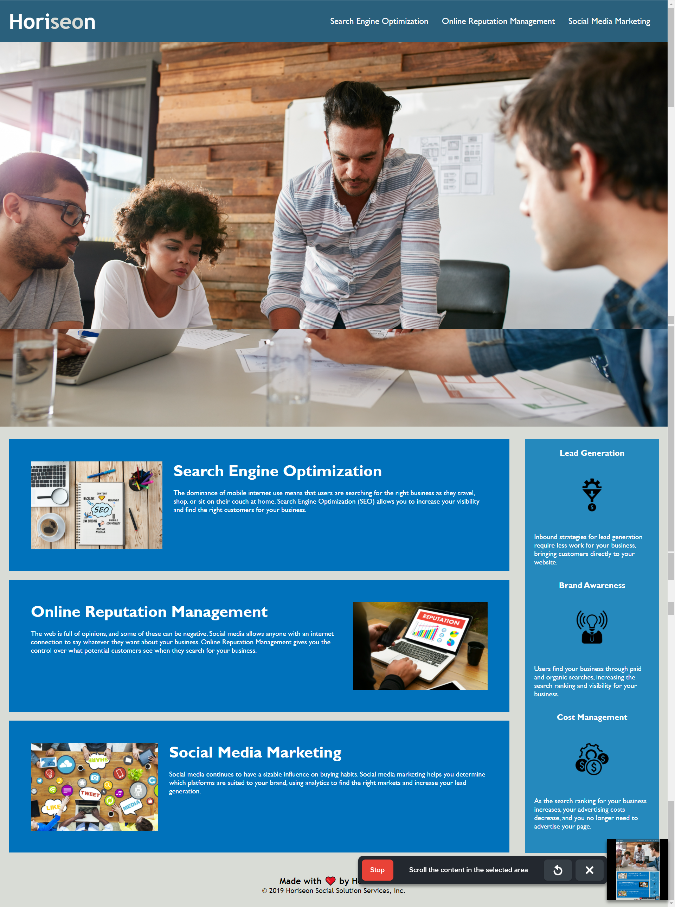

# Homework_CodeRefactor

## Description

Web accessibility is an important consideration for businesses. Web accessibility enables people with disabilities to access a website when they use assistive tools like screen readers. Search engine optimization is a benefit when ensuring that your website is accessive. Additionally there are legal complications that can arise when a web site is built in way that offers no solution for users with disabilities. 

The goal for this project is to refactor the html and css code for the purpose of optimizing it for web acessibility. In it you should find well structured code that uses semantic html elements, structure, clear comments and 'dry' code.

The final product is a landing page or home page website for a consulting company called Horiseon. Horiseon offers different marketing services from search engine optimization to social media management. The site describes some of the benefits to these services using images, captions and supporting texts. 

Here is a link to the live deployed site: 

https://brauliocp59.github.io/Homework_CodeRefactor/

